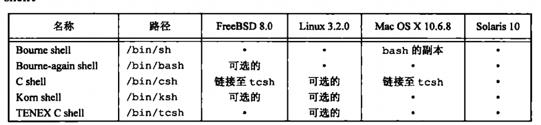
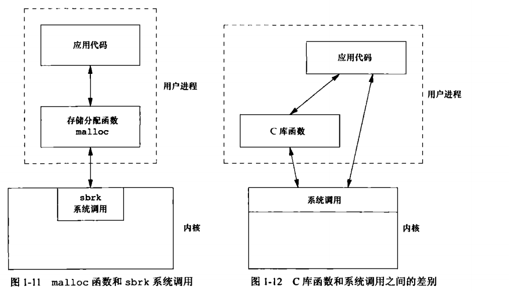

# UNIX基础知识

## 引言
介绍一些操作系统有关基本知识，UNIX也是操作系统的一种，想要深入了解建议去看操作系统
## UNIX体系结构
   操作系统是一种特殊的直接操作硬件资源的软件，管理控制硬件资源。直接管理硬件资源的部分叫做内核，内核的接口被称为系统调用。公共函数库建立在系统调用接口之上，应用程序既可以调用公共函数库，也可以直接系统调用。shell是一种相对与内核的表达，特殊应用程序，也提供接口
  操作系统的优点，简单写的：
- 对不同硬件提供统一接口，让开发变简单。
- 管理硬件资源、异常处理， 让整个软硬件运行更安全。
- 特殊的机制高效使用资源，比如虚拟内存、线程协程等，让软件能够充分利用硬件资源

## 登录
### 登录名
需要用户名密码登录，/etc/passwd
### shell
命令行解释器，通过交互式终端或者脚本执行

- 关系
    - 几乎所有UNIX系统都提供Bourne shell, 控制流结构类似Algol 68
    - 所有BSD版本提供C shell, 控制流结构类似C语言，特色：作业控制、历史机制、命令行编辑
    - Korn shell是Bourne shell后继者，兼容Bourne shell和C shell
    - Bourn-again shell是GNU shell， 所有Linux系统提供，遵循POSIX，保留Bourne shell兼容性，支持C shell和Korn shell特色功能
    - TENEX C shell是C shell的加强版本，多了很多特性
POSIX 1003.2标准对shell进行了标准化，基于Korn shell和Bourne shell的特性
## 文件和目录
### 文件系统
目录和文件的一种层次结构，可以通过linux 内核中简单的ext2文件系统学习文件系统
### 文件名（filename）
目录中各个名字称为文件名
### 路径名(pathname)
由斜线分割一个或多个文件名组成的序列构成文件名。
/开头绝对路径名（absolute pathname）,否则相对路径名(relative pathname),文件系统根目录/ 是一个特殊绝对路径名，包含文件名 。
man man 查看man命令

man -s number cmd
The table below shows the section numbers of the manual followed by the types of pages they contain.

       1   Executable programs or shell commands
       2   System calls (functions provided by the kernel)
       3   Library calls (functions within program libraries)
       4   Special files (usually found in /dev)
       5   File formats and conventions eg /etc/passwd
       6   Games
       7   Miscellaneous (including macro packages and conventions), e.g. man(7), groff(7)
       8   System administration commands (usually only for root)
       9   Kernel routines [Non standard]

### 工作目录
每个进程都有一个工作目录(working directory),也叫当前工作目录(current working directory),相对路径从cwd开始
### 起始目录
home directory, 登录时的目录，在/etc/passwd指定

## 输入和输出
### 文件描述符
file descriptor, 小的非负整数，内核用以标识特定进程正在访问的文件。、
当内核打开现有文件或创建一个新文件时，返回一个文件描述符。读写文件需要用到这个文件描述符
### 标准输入、标准输出、错误输出
每当运行一个新程序，所有的shell 都为其打开3个文件描述符，标准输入(standard input)、标准输出(standard output)、标准错误(standard error)。不做处理都会链接向终端
重定向到文件 ls > file
### 不带缓存的I/O
open,read,write,lseek,close等，不带缓冲的I/O，这些函数都使用文件描述符。
这里的缓冲是指程序到内核之间的缓冲，大概..
### 标准I/O
标准库函数中的I/O函数，一般带缓冲

## 程序和进程
### 程序
program， 存储在磁盘上某个目录中的可执行文件
内核使用exec函数(7个exec函数之一)， 可以将程序读入内存，并执行。
### 进程和进程ID
程序的执行实例被称为进程(process),某些操作系统用任务(task)表示正在被执行的程序
UNIX系统确保每个进程由唯一的数字标识符，进程ID(process ID)。进程ID总是非负整数
### 进程控制
fork, exec(7个), waitpid
### 线程和线程ID
线程（thread）是相当于进程的概念，同一个进程中不同的执行流程，可以在同一个时间段并发执行。而不同的进程可以在同一个时间点并行执行。
多线程可以充分利用多处理器的并行能力

## 出错处理
errno(3)
man 3 errno查看。
线程有自己独立的errno

如果没有出错，就被判断errno值。任何函数都不会将errno设置回0。<errno.h>所有常量都不为0，可以在需要用到errno代码段之前将其改为0，之后再判断。
~~~
/* The error code set by various library functions.  */
extern int *__errno_location (void) __THROW __attribute_const__;
# define errno (*__errno_location ())
~~~
### 出错恢复
致命性、非致命性错误
致命性错误，无法执行恢复动作，最多打打log
非致命性错误，可以延迟重试
## 用户标识
### 用户ID
user ID， 一个数值，/etc/passwd文件中，确定一个用户登录名时同时确定其用户ID。ID无法更改，通常一个用户有唯一ID。用来检验权限
ID为0为root用户，也叫superuser,该用户大部数文件权限检查不再进行。某些操作系统功能指向root用户提供
### 组ID
group ID, 一个数值。系统管理员在指定用户登录名分配的。
多个登陆项有相同组ID，可以共享资源。组文件/etc/group
wen@ubuntu:~/wendir$ cat /etc/group
root:x:0:
daemon:x:1:
bin:x:2:
sys:x:3:
adm:x:4:syslog,wen
tty:x:5:
disk:x:6:
lp:x:7:
mail:x:8:
### 附属组ID
一个用户可以属于另外一些组。supplementary group ID
## 信号
signal,通知进程发生了某些情况。
三种信号处理方式：
1. 忽略信号
2. 系统默认方式处理
3. 提供一个函数， 信号发生时调用该函数

终端键盘产生信号：中断键(interrupt key, Delete或者ctrl+D),退出键(quit key, 通常时ctrl + \)
## 时间值
1. 日历时间，自1970年1月1日00：00：00 (Coordinated Universal Time, UTC)经过的秒数累计值，time_t类型
2. 进程时间，CPU时间。度量进程使用cpu资源。进程时间以始终计算，每秒取50、60、100个时钟。
clock_t保存这个值，可以使用sysconf取每秒多少个时钟。

度量一个进程执行时间，一个进程维护3个进程时间值
- 时间时钟
- 用户CPU时间
- 系统CPU时间

时钟时间，墙上时钟时间(wall clock time),进程运行的时间总量，值与系统中同时运行进程数有关。
用户CPU时间， 执行用户指令所用的时间量
系统CPU时间， 执行内核程序所经历时间，合起来叫CPU时间

time(1)
wen@ubuntu:~/wendir$ time man time

real	0m0.842s
user	0m0.031s
sys	0m0.030s
## 系统调用与库函数
所有的操作系统都提供多种服务的入口点，由此程序向内核请求服务。各种版本的UNIX实现都提供良好定义、数量有限、直接进入内核的入口点，这些入口点被称为系统调用(system call)
UNIX所使用的技术是为每个系统调用在标准C库中设置--个具有同样名字的函数。用户进程用标准C调用序列来调用这些函数，然后，函数又用系统所要求的技术调用相应的内核服务。例如，函数可将-一个或多个C参数送入通用寄存器，然后执行某个产生软中断进入内核的机器指令。从应用角度考虑，可将系统调用视为C函数。

## 小结
本节介绍操作系统的一些基本常识