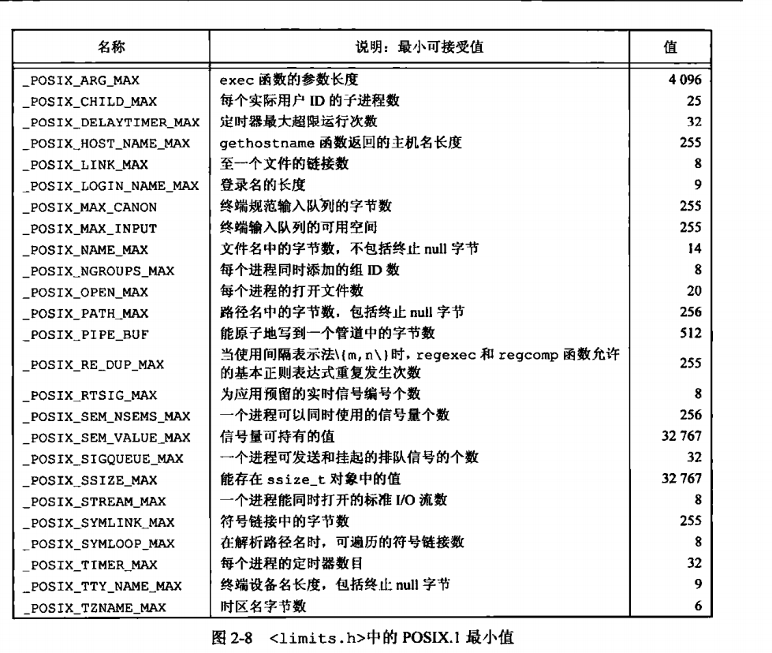
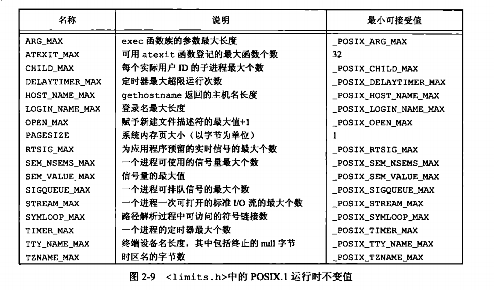
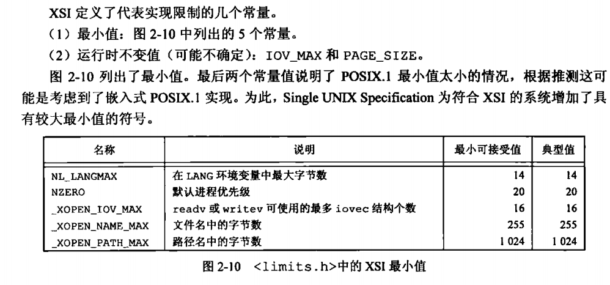
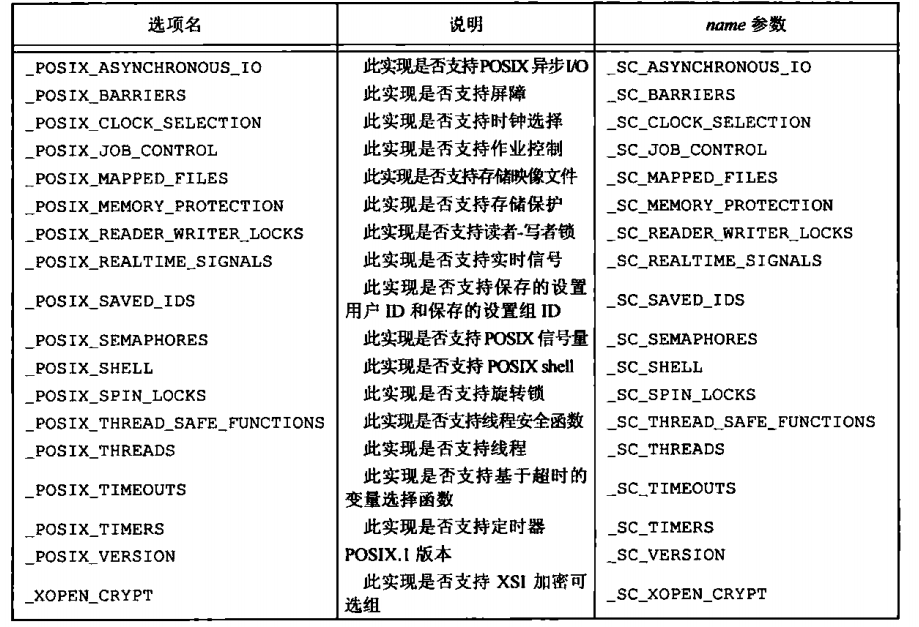
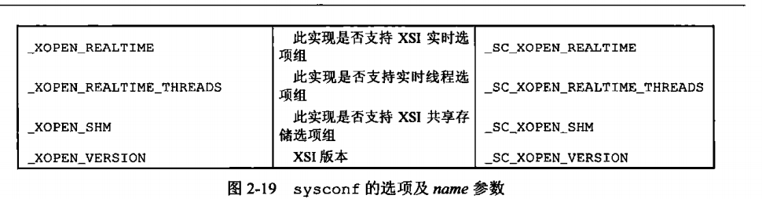

# UNIX标准化及实现
## UNIX标准化
### ISO C
###　IEEE POSIX
### Single UNIX Specification
### FIPS
POSIX.1 FIPS已经撤回

## UNIX标准化实现
### SVR4
### BSD
### FreeBSD
### Linux
### Mac OS X
### Solaris
### 其他
- AIX
- HP-UX
- IRIX
- UnixWare

## 标准与实现的关系
## 限制
编译时限制(如短整型最大值) 和 运行时限制(文件名最多多少字符)。

解决跨平台限制不同问题：
- 编译时限制(头文件)                                       // 静态的
- 与文件或目录无关的运行时限制(sysconf)                     // 跟操作系统有关，在程序执行的过程中，改变操作系统的参数等会导致这些值修改
- 与文件或目录有关的运行时限制(pathconf 和 fpathconf)       // 跟文件系统有关，不同文件系统，可能会有不同的限制

这里的变与不变值程序运行过程中，是否会发生变化。

### ISO C限制
在<limits.h>头文件中
locate limits.h
CHAR char
SCHAR signed char
INT int
UINT unsigned short
LONG    long
LLONG   unsigned long
MB_LEN_MAX  在一个多字节字符常量中的最大字节数
BIT位数
MAX最大
MIN最小

### POSIX 限制
1. 数值限制
2. 最小值
3. 最大值
4. 运行时可以增加的值
5. 运行时不变值
6. 其他不变值
7. 路径名可变值

分布在<limits.h>和sysconf,pathconf,fpathconf函数中

### XSI限制

### 函数sysconf,pathconf,fpathconf
man sysconf
man pathconf

#include <unistd.h>
       long sysconf(int name);
       long fpathconf(int fd, int name);
       long pathconf(const char *path, int name);
获取POSIX的运行时限制

## 选项

程序可能依赖于POSIX可选的支持功能，以下用来判断是否支持某些功能

## 功能测试宏
_POSIX_C_SOURCE, _XOPEN_SOURCE

CC -D_POSIX_C_SOURCE=200809L file.c
