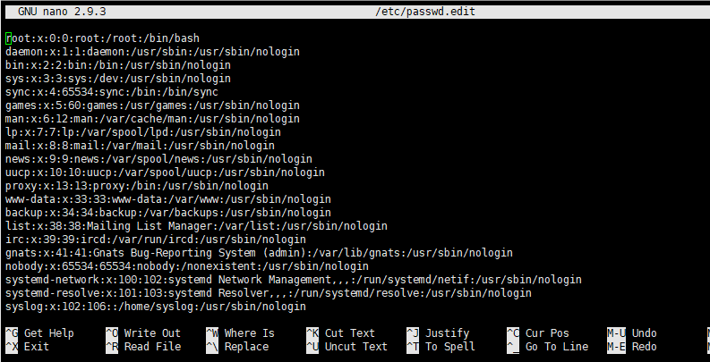

# 系统数据文件和信息
## 引言
unix系统运作用到大量系统有关文件，如口令文件/etc/passwd, 组文件/etc/group,用户每次登录unix及ls -l都会用到口令文件

历史原因这些文件都是ASCII文本文件，但对于复杂系统，可能非文本文件更好，所以需要提供接口

## 口令文件

UNIX系统口令文件(POSIX.1 用户数据库)

in <pwd.h>

/* The passwd structure.  */
struct passwd
{
  char *pw_name;                /* Username.  */
  char *pw_passwd;              /* Password.  */
  __uid_t pw_uid;               /* User ID.  */
  __gid_t pw_gid;               /* Group ID.  */
  char *pw_gecos;               /* Real name.  */
  char *pw_dir;                 /* Home directory.  */
  char *pw_shell;               /* Shell program.  */
};

在freeBSD8.0和Mac OS X 10.6.8中还有用户访问类char* pw_class
下次更改口令时间 time_t pw_change
账户有效时间 time_t pw_expire
后续补充

[root@localhost ~]# cat /etc/passwd
wen@ubuntu:~$ cat /etc/passwd
root:x:0:0:root:/root:/bin/bash
daemon:x:1:1:daemon:/usr/sbin:/usr/sbin/nologin
bin:x:2:2:bin:/bin:/usr/sbin/nologin
sys:x:3:3:sys:/dev:/usr/sbin/nologin
sync:x:4:65534:sync:/bin:/bin/sync
games:x:5:60:games:/usr/games:/usr/sbin/nologin
man:x:6:12:man:/var/cache/man:/usr/sbin/nologin
lp:x:7:7:lp:/var/spool/lpd:/usr/sbin/nologin
mail:x:8:8:mail:/var/mail:/usr/sbin/nologin
news:x:9:9:news:/var/spool/news:/usr/sbin/nologin
uucp:x:10:10:uucp:/var/spool/uucp:/usr/sbin/nologin
proxy:x:13:13:proxy:/bin:/usr/sbin/nologin
www-data:x:33:33:www-data:/var/www:/usr/sbin/nologin
backup:x:34:34:backup:/var/backups:/usr/sbin/nologin
speech-dispatcher:x:111:29:Speech Dispatcher,,,:/var/run/speech-dispatcher:/bin/false
whoopsie:x:112:117::/nonexistent:/bin/false
kernoops:x:113:65534:Kernel Oops Tracking Daemon,,,:/:/usr/sbin/nologin
saned:x:114:119::/var/lib/saned:/usr/sbin/nologin
pulse:x:115:120:PulseAudio daemon,,,:/var/run/pulse:/usr/sbin/nologin
avahi:x:116:122:Avahi mDNS daemon,,,:/var/run/avahi-daemon:/usr/sbin/nologin
colord:x:117:123:colord colour management daemon,,,:/var/lib/colord:/usr/sbin/nologin
hplip:x:118:7:HPLIP system user,,,:/var/run/hplip:/bin/false
geoclue:x:119:124::/var/lib/geoclue:/usr/sbin/nologin
gnome-initial-setup:x:120:65534::/run/gnome-initial-setup/:/bin/false
nobody:x:65534:65534:nobody:/nonexistent:/usr/sbin/nologin

说明：
- 字段:分割
- root登录项，uid为0，超级用户
- 加密口令x 占位符， 实际存放在别的文件
- 加密口令字段为空，没有口令（不推荐），pw_gecos字段注释字段，啥都能写
-  pw_shell字段可执行性文件名。如squid登录名，其pw_shell字段为/dev/null设备不是可执行文件组织任何人登录，不过我这个环境里面没有。这种操作是为了是守护进程使用不同uid

~~~
wen@ubuntu:~/wendir$ /bin/true 
wen@ubuntu:~/wendir$ echo $?
0
wen@ubuntu:~/wendir$ /bin/false
wen@ubuntu:~/wendir$ echo $?
1
wen@ubuntu:~/wendir$ /usr/sbin/nologin 
This account is currently not available.
wen@ubuntu:~/wendir$ echo $?
1
~~~

~~~
finger需要安装
wen@ubuntu:~/wendir$ finger -p root
Login: root           			Name: root
Directory: /root                    	Shell: /bin/bash
Never logged in.
No mail.
wen@ubuntu:~/wendir$ finger -p wen
Login: wen            			Name: ubt
Directory: /home/wen                	Shell: /bin/bash
On since Thu May  6 23:19 (+08) on :0 from :0 (messages off)
On since Sat Jun 19 10:42 (+08) on pts/3 from 192.168.1.107
   2 seconds idle
No mail.
~~~

